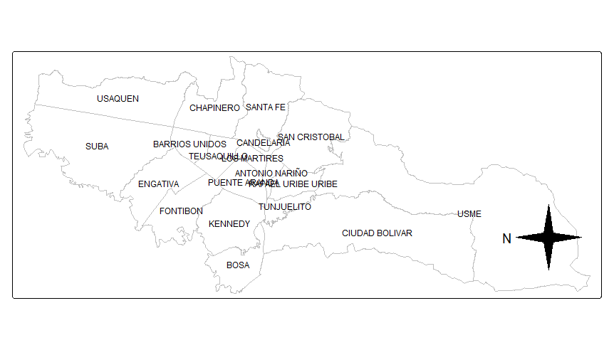

# Local Oblique Mercator Projection for "Rotated" Maps

This repository contains a simple function, `crs_rotate()`, that facilitates rotating maps created in R using ad-hoc **oblique Mercator projections**. The function uses the centroid of a spatial feature collection, `sf`, and a specified angle as the parameters for the projection.

The function is useful for maps that follow cartographic conventions (e.g., the usual orientation of maps of cities like Toronto or Bogota), or that align with certain spatial features (e.g., metro lines). Note that this is an implementation of a solution posted to [Stack Overflow](https://stackoverflow.com/questions/66889558/rotate-ggplot2-maps-to-arbitrary-angles).

## Function

``` r
library(sf)

crs_rotated = function(x, angle_deg){
  x_centroid = st_centroid(st_union(x))
  x_centroid = st_transform(x_centroid, crs=4326)
  lon = st_coordinates(x_centroid)[,1]
  lat = st_coordinates(x_centroid)[,2]
  return(paste0("+proj=omerc +lat_0=",
               lat,
               " +lonc=",
               lon,
               " +alpha=0 +gamma=",
               angle_deg,
               " +k=1 +datum=WGS84 +units=m +no_defs")
  )
}
```

## Example Usage

``` r
# Take any `sf` object (polygon or polyline) -- in this case, Bogota's localidades -- and a desired rotation angle -- in this case, 270 degrees

library(sf)

bogota = st_read("bogota_localidades.gpkg")
angle = 270

proj_string = crs_rotated(bogota, 270)

# Plug the resulting string into a map using any mapping package

library(tmap)

tm_shape(bogota[!bogota$LocNombre=='SUMAPAZ',]) +
  tm_borders(col = 'gray') +
  tm_text(text = 'LocNombre', size = 0.5) +
  tm_compass(north = angle, type = '4star') +
  tm_crs(crs_string)
```

The resulting map:



## Dependencies

* `sf`

## Note on Compass Orientation

As in the example above using `tmap`, make sure to pass the same **rotation angle** to the compass--in this case, using the `north` argument in the `tm_compass()` function.

## License

MIT License

